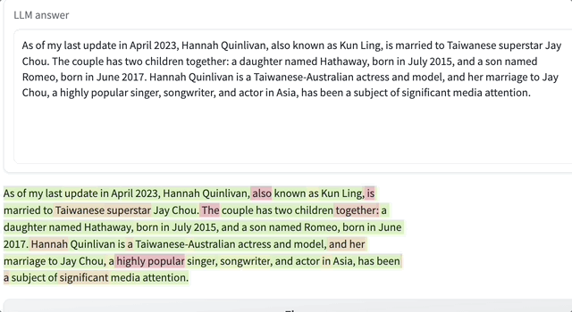
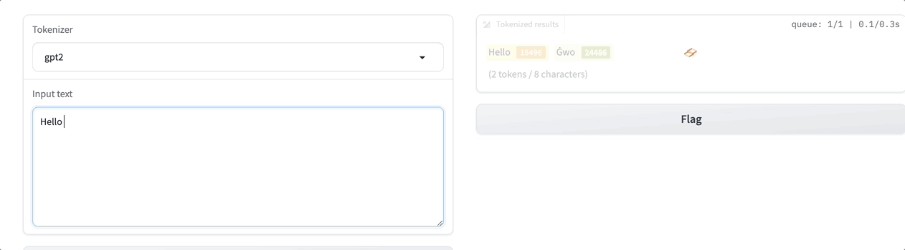

## Introduction
token visualizer is a token-level visualization tool to visualize LLM.

## Quick start

### Installation

#### Install from source

Run the following command to install the package.
```shell
git clone git@github.com:FateScript/token_visualizer.git
cd token_visualizer
pip install -v -e .  # or  python3 setup.py develop
```

#### Check installation

If you could see the version of `token_visualizer` by running 
```shell
python3 -c "import token_visualizer; print(token_visualizer.__file__)"
```

## Visualization demo

### Inference

#### Start demo
Run the following command to start inference visualizer.
```shell
python3 visual_inference.py
```

The command will start a OpenAIProxy model, to use it without exception, user should fill in the value of `BASE_URL` and `OPENAI_KEY`.

`token_visualizer` also support `OpenAIModel` and HuggingFace `TransformerModel` in [models.py](https://github.com/FateScript/token_visualizer/blob/main/token_visualizer/models.py), feel free to modify the code.

#### Demo gif
After inputing your prompt, you will see the large language model's answer and the answer's visualization result.



**The redder the color of the token, the lower the corresponding probability. The greener the color of the token, the higher the corresponding probability.**

### Tokenizer

#### Start demo
Run the following command to start interactive tokenizer encoding web demo.

```shell
python3 visual_tokenizer.py
```

#### Demo gif
User could select tokenizer to interacte with and text to encode. For speical string 



## TODO
- [ ] Support multi-turn chat visualization.
- [ ] Support ppl visualization.
- [ ] Support TGI generate result.
- [ ] Support dark mode.


## Related projects/websites

* [LLM architecture visualization](https://bbycroft.net/llm)
* [perplexity visualization](https://bbycroft.net/ppl)


## Acknowledgement

* Use front-end setting from [https://perplexity.vercel.app/](https://bbycroft.net/ppl)
* Color algorithm from [post](https://twitter.com/thesephist/status/1617909119423500288) by [thesephist](https://twitter.com/thesephist).
